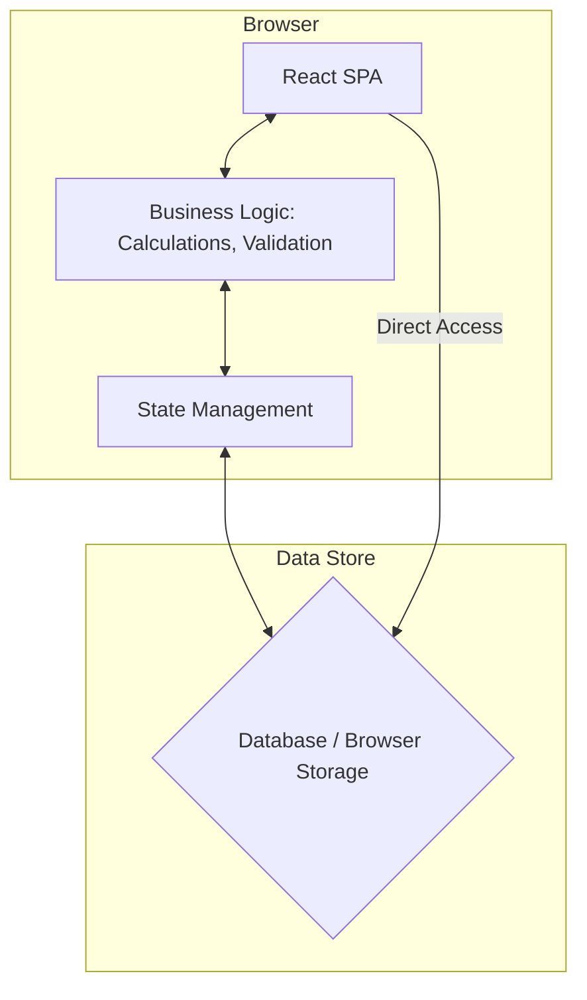

# Architectural Evolution Plan: WealthWise

**Author**: GitHub Copilot (as Architect)  
**Date**: October 22, 2025  
**Status**: Proposed

## 1. Introduction & Motivation

The current architecture of WealthWise is a client-heavy Single Page Application (SPA). While this was effective for initial development, it is reaching its limits in terms of **performance, scalability, and security**. Complex financial calculations are performed in the browser, leading to UI freezes with large datasets and "overloading the website." Furthermore, sensitive business logic is exposed on the client side.

This document proposes a migration to a modern, scalable, and secure **Serverless Backend Architecture** using the Firebase platform. This evolution will address current performance bottlenecks and provide a robust foundation for future growth.

## 2. Current Architecture (As-Is)

The existing system is a classic SPA where the client is responsible for almost everything.

- **Client**: A React-based web application.
- **Business Logic**: All financial calculations, data validation, and state management are handled in the browser using TypeScript/JavaScript.
- **Data Storage**: Likely using browser storage (e.g., LocalStorage) or a simple, direct-to-database connection from the client, which is not secure or scalable.
- **Authentication**: Potentially a simple client-side library or a basic token-based system.

### 2.1. Current Architecture Diagram



### 2.2. Key Limitations

- **Performance**: Heavy computations block the UI thread, causing lag, especially with large transaction histories or complex reports.
- **Scalability**: Cannot scale to support more users or data efficiently. Every client does its own work, with no shared, optimized processing.
- **Security**: Business logic is exposed. Direct database access from the client is a major security vulnerability. Data validation on the client can be bypassed.
- **Maintainability**: A monolithic frontend becomes difficult to manage and update.
- **No Offline/Real-time Sync**: Poor experience for users with intermittent connectivity.

## 3. Future Architecture (To-Be)

The proposed architecture is a **Serverless model** leveraging the Firebase ecosystem. This model separates the frontend (presentation layer) from the backend (business and data layer).

- **Client (Frontend)**: The React SPA is refactored to be a "thin client." Its primary role becomes UI rendering and user interaction. It will no longer contain complex business logic.
- **Backend (Firebase)**:
    - **Firebase Authentication**: Manages user identity securely.
    - **Cloud Firestore**: A scalable, real-time NoSQL database that acts as the single source of truth.
    - **Cloud Functions**: Serverless functions that contain all business logic. The client will trigger these functions to perform tasks.
- **Analytics**:
    - **Google Analytics for Firebase**: Captures user interaction events for behavior analysis and performance monitoring.

### 3.1. Future Architecture Diagram (High-Level Design)

```mermaid
graph TD
    subgraph "User's Browser"
        A[React SPA (Thin Client)] -- HTTPS Request --> B[Firebase SDK]
    end

    subgraph "Google Cloud / Firebase"
        B -- Secure Call --> C[Cloud Functions]
        B -- Real-time Listener --> D[Cloud Firestore]
        C -- Reads/Writes --> D
        E[Firebase Authentication]
        F[Google Analytics]
    end

    A -- Emits Events --> F
    A -- Auth Flow --> E
    B -- Authenticates with --> E

    style C fill:#f9f,stroke:#333,stroke-width:2px
    style D fill:#f80,stroke:#333,stroke-width:2px
```

### 3.2. High-Level Design (HLD)

- **Authentication Flow**: The React client will use the Firebase Auth SDK to sign users in. On successful login, Firebase provides a secure JWT (ID Token).
- **Data Flow (Write Operations)**:
    1. User performs an action (e.g., adds a transaction).
    2. The React client calls a specific Cloud Function via the Firebase SDK, passing the raw data.
    3. The Cloud Function receives the data, performs validation, executes business logic (e.g., calculates impact on budget), and writes the final, trusted data to Firestore.
- **Data Flow (Read Operations)**:
    1. The React client uses the Firestore SDK to subscribe to data collections (e.g., `transactions`).
    2. Firestore rules ensure the user can only read their own data.
    3. Data is streamed in real-time to the client. The UI updates automatically as data changes in the database.
- **Analytics Flow**: The React client will use the Analytics SDK to log events (e.g., `create_budget`, `view_report`) with relevant parameters. These events are visible in the Firebase console.

## 4. Low-Level Design (LLD) & Migration Plan

This section details the concrete steps and changes required to migrate from the current architecture to the new one.

### Phase 1: Setup & Authentication (1-2 weeks)

1.  **Setup Firebase Project**:
    - Create a new Firebase project in the Google Cloud console.
    - Enable **Authentication** (with Email/Password and Google providers).
    - Enable **Cloud Firestore** and configure security rules.
    - Enable **Google Analytics**.
    - Enable **Cloud Functions**.

2.  **Integrate Firebase SDK**:
    - `npm install firebase` in the `webapp` directory.
    - Create a Firebase initialization file (`/webapp/src/core/firebase/firebase.ts`) with project credentials.

3.  **Migrate Authentication**:
    - **LLD**:
        - Replace existing authentication logic with Firebase Auth SDK.
        - Create `useAuth` hook to provide user state (`{ user, isLoading }`) throughout the app.
        - Update login/signup forms to call `signInWithEmailAndPassword` or `createUserWithEmailAndPassword`.
        - Protect routes based on the `useAuth` hook's state.
    - **Changes**:
        - Modify `App.tsx`, login/signup components, and route management.

### Phase 2: Backend Logic & Database Migration (3-4 weeks)

This is the most critical phase. We will migrate one feature at a time. Let's use **Budgets** as the pilot feature.

1.  **Data Model in Firestore**:
    - **LLD**: Define the Firestore collection structure. For budgets:
        - `users/{userId}/budgets/{budgetId}` (Document)
        - `users/{userId}/budgets/{budgetId}/categories/{categoryId}` (Sub-collection)
    - This structure ensures data is user-scoped and queries are efficient.

2.  **Create Cloud Functions for Budgets**:
    - **LLD**:
        - Set up the functions directory (`/functions`).
        - Write `createBudget` function:
            - Takes `BudgetFormData` as input.
            - Validates data (e.g., name length, positive amounts).
            - Creates documents in `budgets` and `budget_categories` collections.
        - Write `updateBudget` and `deleteBudget` functions.
        - Write a `calculateBudgetProgress` function that can be triggered on-demand or when transactions are updated.
    - **Technology**: Use TypeScript for Cloud Functions.

3.  **Refactor Frontend Budget Feature**:
    - **LLD**:
        - Update the `budgetStore` (Zustand) to call Cloud Functions instead of performing logic locally.
        - The `createBudget` action in the store will now invoke the `createBudget` Cloud Function.
        - Refactor the `BudgetsListNew` component to fetch data from Firestore using a real-time listener (`onSnapshot`). This provides automatic UI updates.
    - **Changes**:
        - `webapp/src/core/services/budgetService.ts` will be deprecated in favor of Cloud Functions.
        - `webapp/src/core/stores/budgetStore.ts` will be heavily modified.
        - `webapp/src/features/budgets/components/*.tsx` files will be updated to use the new store actions and data hooks.

4.  **Data Migration**:
    - Write a one-time script (can be a Cloud Function or a local Node.js script) to migrate existing budget data from the old database/format to the new Firestore structure.

### Phase 3: Analytics Integration (1 week)

1.  **Create an Analytics Service**:
    - **LLD**: Create a wrapper service (`/webapp/src/core/services/analyticsService.ts`) that exposes simple methods like `trackEvent(eventName, params)`.
    - This abstracts the Firebase Analytics SDK and provides a consistent way to log events.

2.  **Instrument the Application**:
    - **LLD**: Call `analyticsService.trackEvent` at key user interaction points.
    - **Examples**:
        - `trackEvent('create_budget', { template: '50/30/20' })`
        - `trackEvent('view_report', { report_type: 'cash_flow' })`
        - `trackEvent('login', { method: 'google' })`
    - **Changes**: Add tracking calls to components and hooks across the application.

### Phase 4: Incremental Rollout

- Repeat **Phase 2** for other core features:
    - Transactions
    - Accounts
    - Goals
    - Reports
- This incremental approach de-risks the migration and allows for continuous delivery of value.

## 5. Required Changes Summary

- **New Dependencies**: `firebase`.
- **New Directories**: `/functions` for Cloud Functions code.
- **Major Refactoring**:
    - All data-mutating logic will be removed from the client and moved into Cloud Functions.
    - All direct data fetching will be replaced with Firestore SDK listeners.
    - All core stores (Zustand) will be updated to interact with Firebase services.
- **Authentication**: Complete replacement of the current system with Firebase Authentication.
- **Configuration**: New Firebase configuration files will be added to the project.
- **Deployment**: The deployment process will be updated to deploy the web app to Firebase Hosting and the backend logic to Cloud Functions (`firebase deploy`).
