# WealthWise Component Diagrams

## High-Level System Architecture

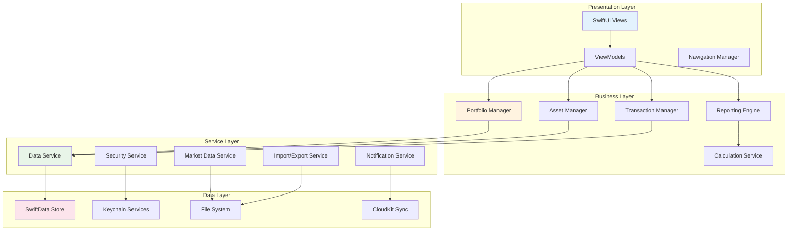

## UI Component Architecture

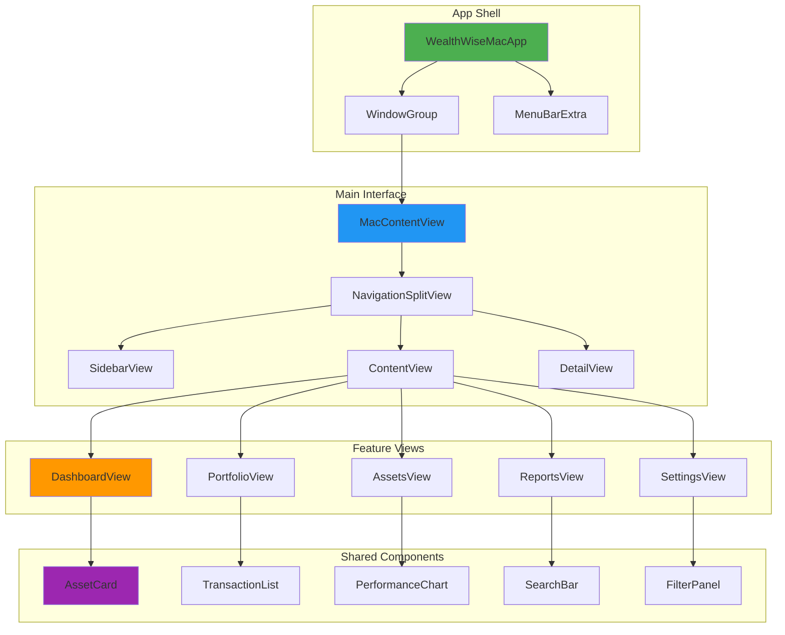

## Data Flow Components

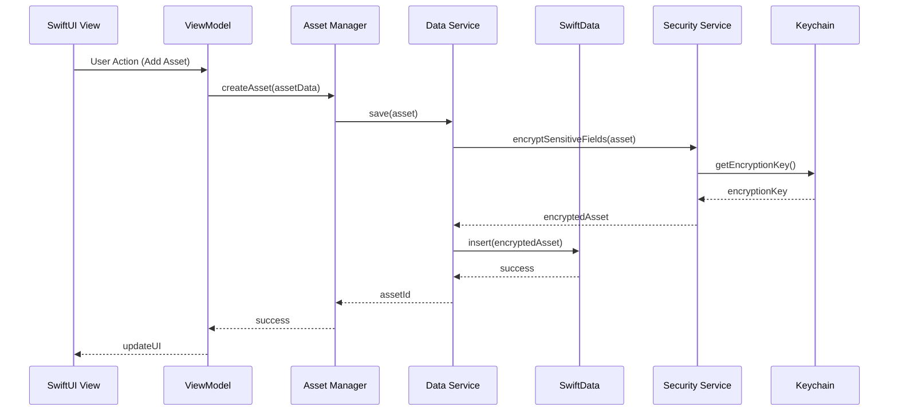

## Security Components

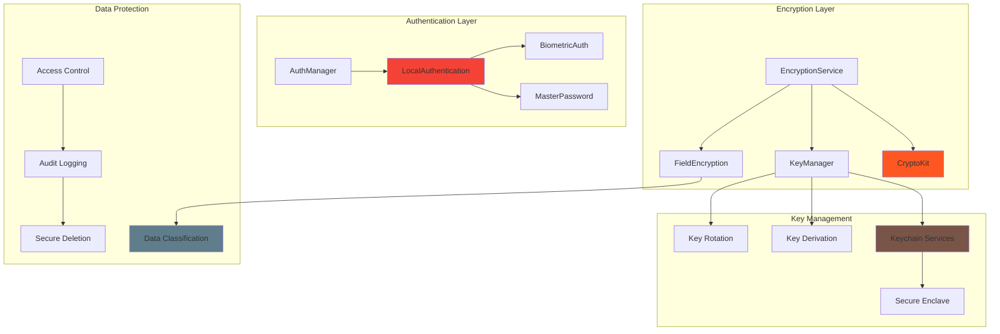

## Business Logic Components

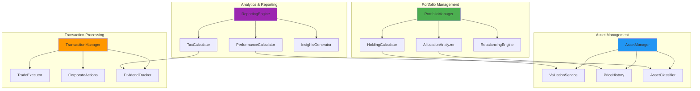

## Service Layer Architecture

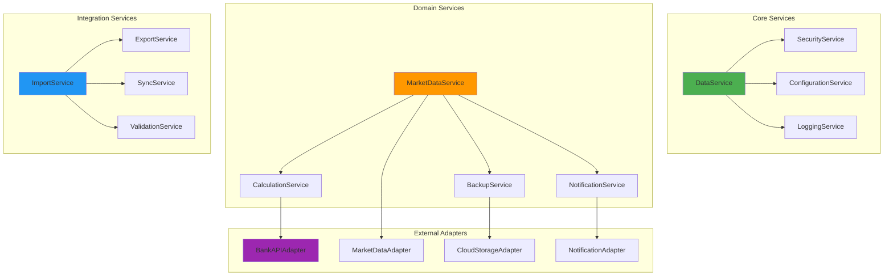

## Data Layer Components

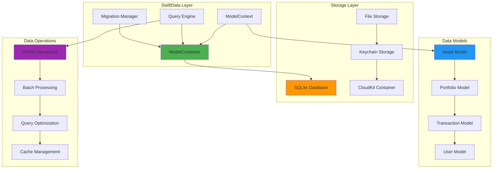

## Dependency Injection Architecture

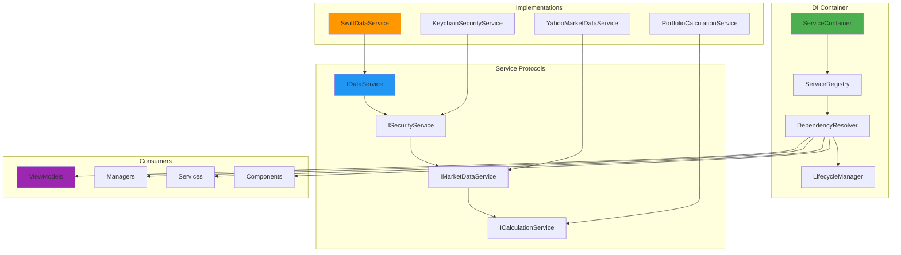

## Testing Architecture

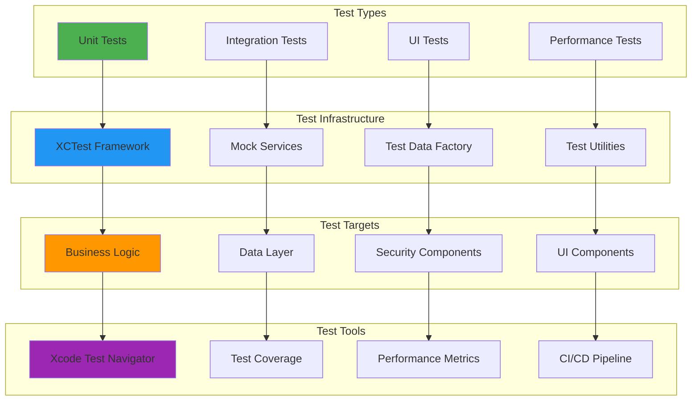

## Performance & Monitoring

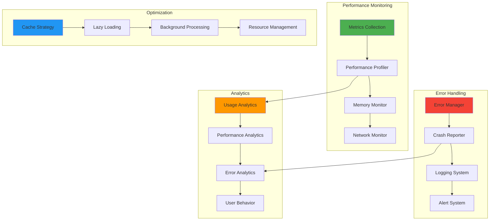

## Deployment Components

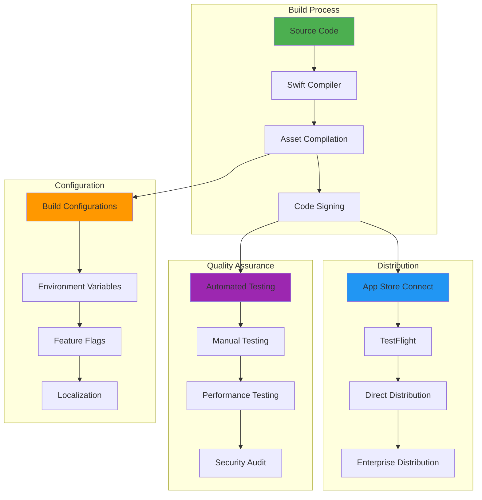

## Notes

### Component Responsibilities

#### Presentation Layer
- **SwiftUI Views**: User interface rendering and interaction
- **ViewModels**: State management and business logic coordination  
- **Navigation**: App flow and deep linking management

#### Business Layer
- **Managers**: Core business logic and workflow orchestration
- **Services**: Specific domain functionality and calculations
- **Engines**: Complex processing and analysis algorithms

#### Data Layer
- **SwiftData**: Local database management and querying
- **Services**: Data access abstraction and caching
- **Security**: Encryption, authentication, and key management

### Communication Patterns
- **Protocols**: Define service interfaces and contracts
- **Dependency Injection**: Loose coupling and testability
- **Combine**: Reactive programming for data flow
- **Async/Await**: Asynchronous operation management

### Error Handling Strategy
- **Result Types**: Explicit error handling in service layer
- **Error Propagation**: Structured error bubbling to UI
- **Logging**: Comprehensive error tracking and analysis
- **Recovery**: Graceful degradation and retry mechanisms