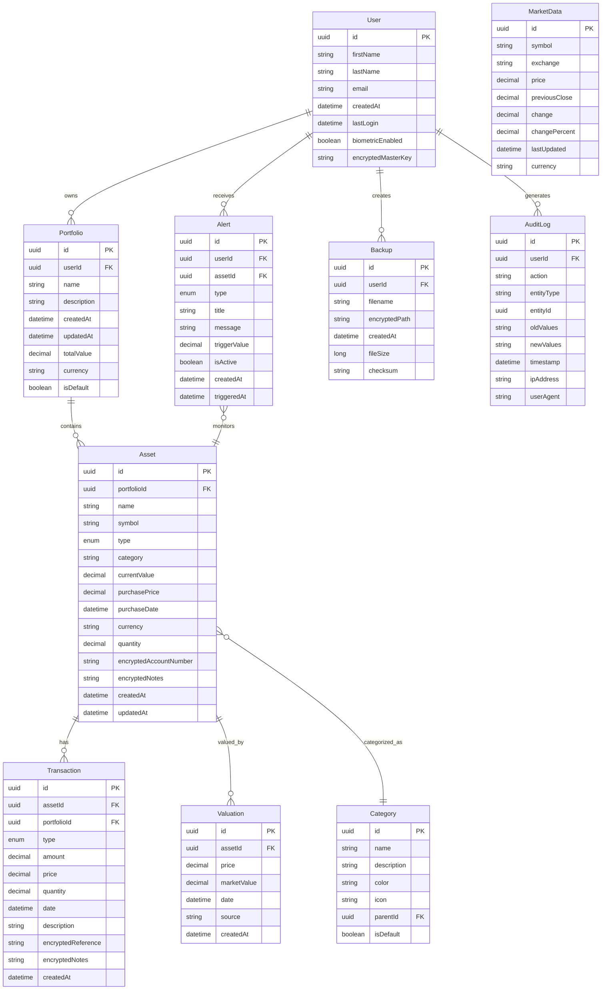
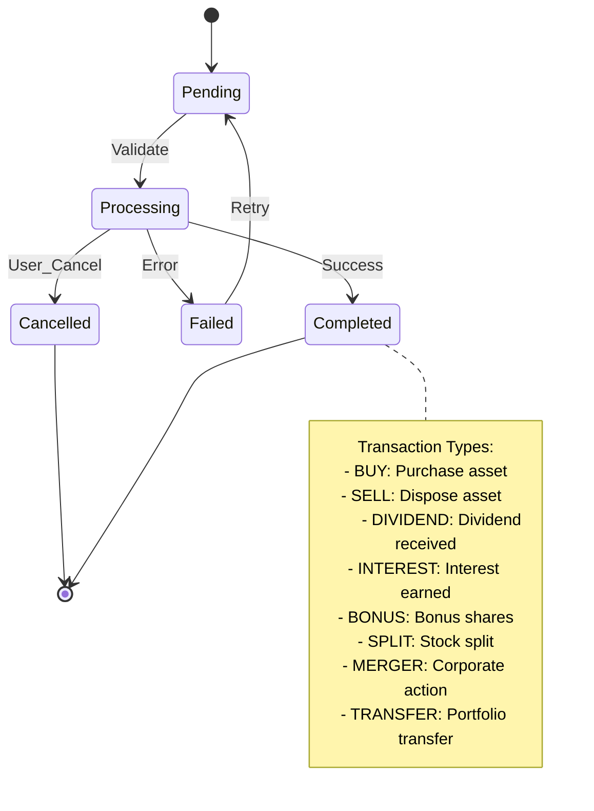
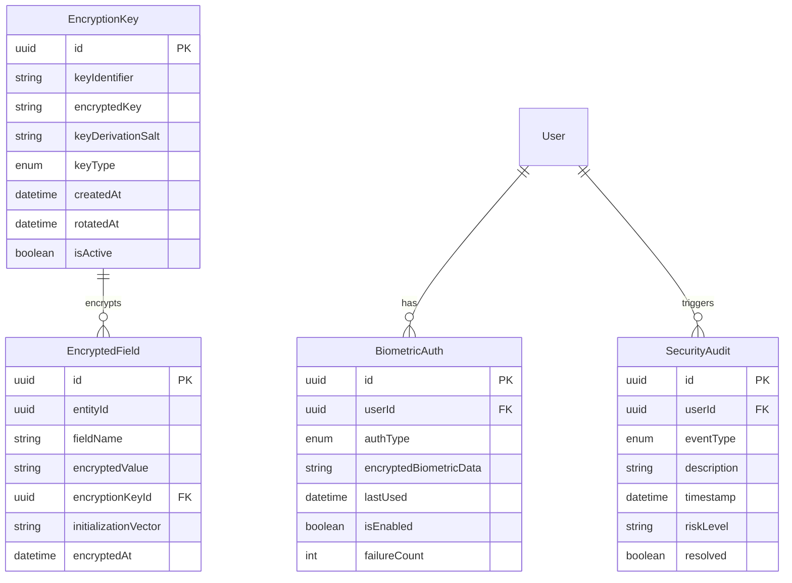
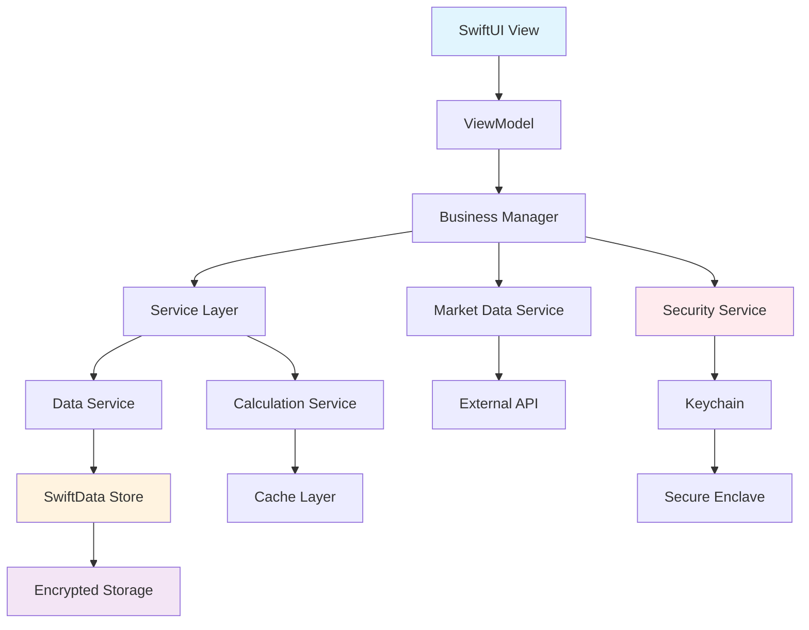
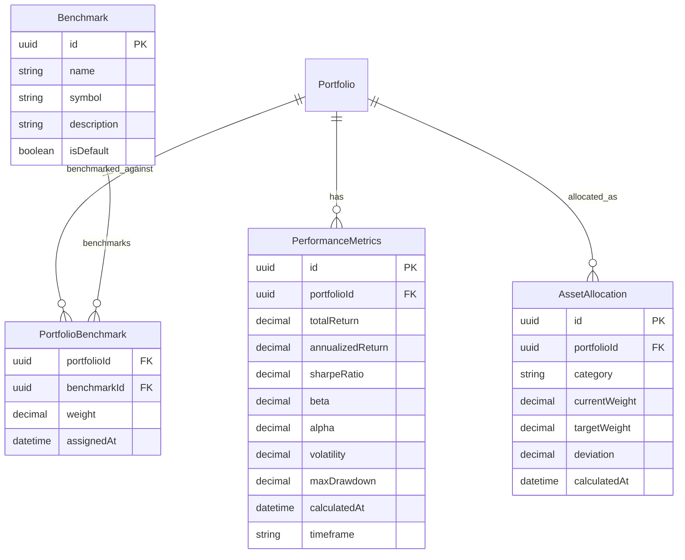
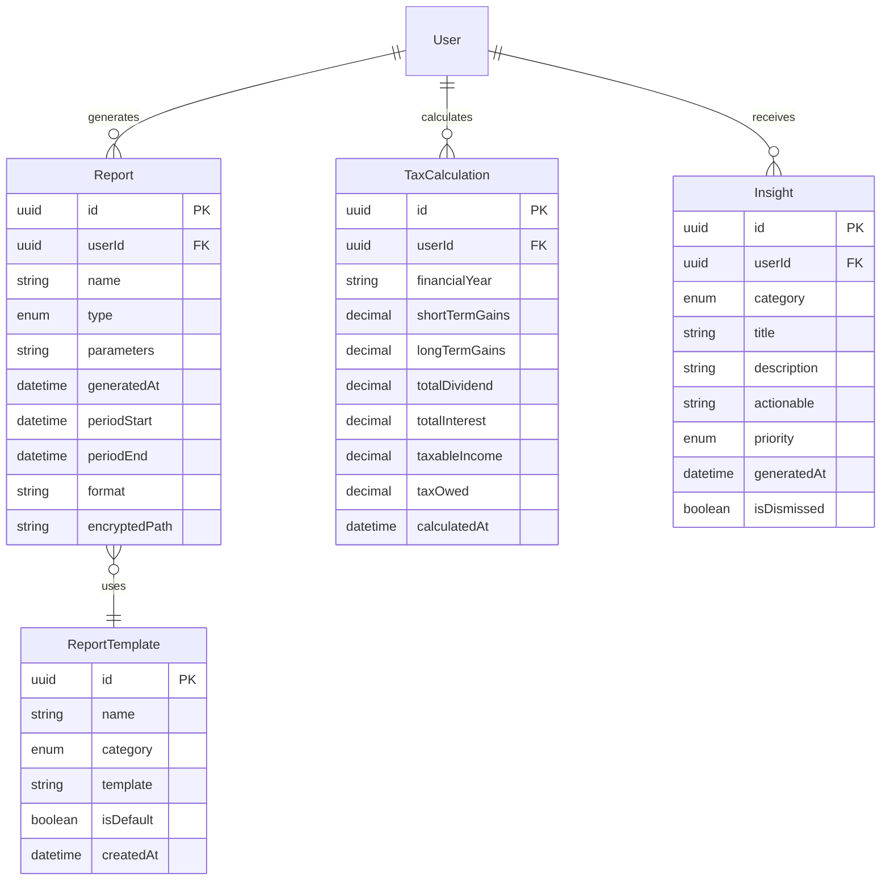
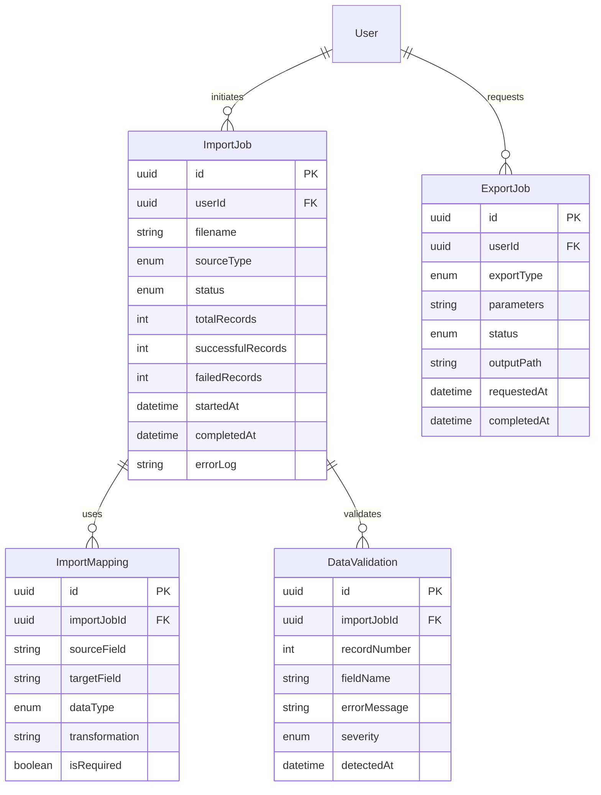
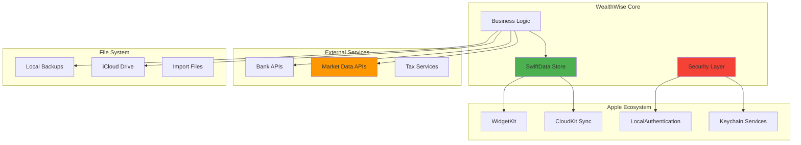

# WealthWise Entity-Relationship Diagrams

## Core Entity Model



## Asset Type Hierarchy

```
Asset Types:
├── Financial Securities
│   ├── Stocks
│   │   ├── Equity Shares
│   │   ├── Preference Shares
│   │   └── ADRs/GDRs
│   ├── Mutual Funds
│   │   ├── Equity Funds
│   │   ├── Debt Funds
│   │   ├── Hybrid Funds
│   │   └── ELSS Funds
│   ├── ETFs
│   │   ├── Index ETFs
│   │   ├── Gold ETFs
│   │   └── International ETFs
│   └── Bonds
│       ├── Government Bonds
│       ├── Corporate Bonds
│       └── Municipal Bonds
├── Bank Products
│   ├── Fixed Deposits
│   ├── Recurring Deposits
│   ├── Savings Accounts
│   └── Current Accounts
├── Alternative Investments
│   ├── Real Estate
│   │   ├── Residential Property
│   │   ├── Commercial Property
│   │   └── REITs
│   ├── Commodities
│   │   ├── Gold (Physical)
│   │   ├── Silver
│   │   └── Other Precious Metals
│   ├── Traditional Investments
│   │   ├── Chit Funds
│   │   ├── Post Office Schemes
│   │   └── Insurance (ULIP/Endowment)
│   └── Cryptocurrency
│       ├── Bitcoin
│       ├── Ethereum
│       └── Other Altcoins
└── Cash & Equivalents
    ├── Cash in Hand
    ├── Bank Balances
    └── Money Market Funds
```

## Transaction Types & States



## Security & Encryption Model



## Data Flow Architecture



## Portfolio Performance Calculations



## Reporting & Analytics Model



## Import/Export Data Model



## System Integration Points



## Notes

### Entity Constraints
1. **User**: Single user per application instance
2. **Portfolio**: User can have multiple portfolios, one default
3. **Asset**: Must belong to exactly one portfolio
4. **Transaction**: Must reference valid asset and portfolio
5. **Valuation**: Historical price data, multiple per asset

### Encryption Strategy
- **Field-Level**: Sensitive data encrypted before storage
- **Key Management**: Master key derived from biometric/password
- **Key Rotation**: Periodic rotation with migration support
- **Backup Security**: Separate encryption for export files

### Performance Considerations
- **Indexing**: Primary keys, foreign keys, date fields
- **Caching**: Calculated values cached with invalidation
- **Batch Operations**: Bulk imports/exports optimized
- **Lazy Loading**: Large datasets loaded on demand

### Data Integrity
- **Referential Integrity**: Foreign key constraints
- **Validation Rules**: Data type and range validation  
- **Audit Trail**: All changes logged for compliance
- **Backup Verification**: Checksums for data integrity