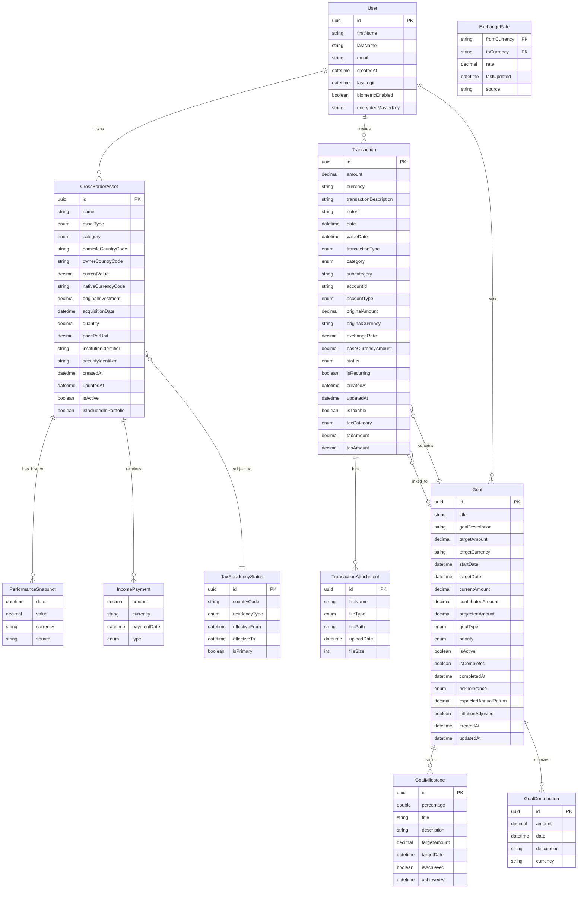
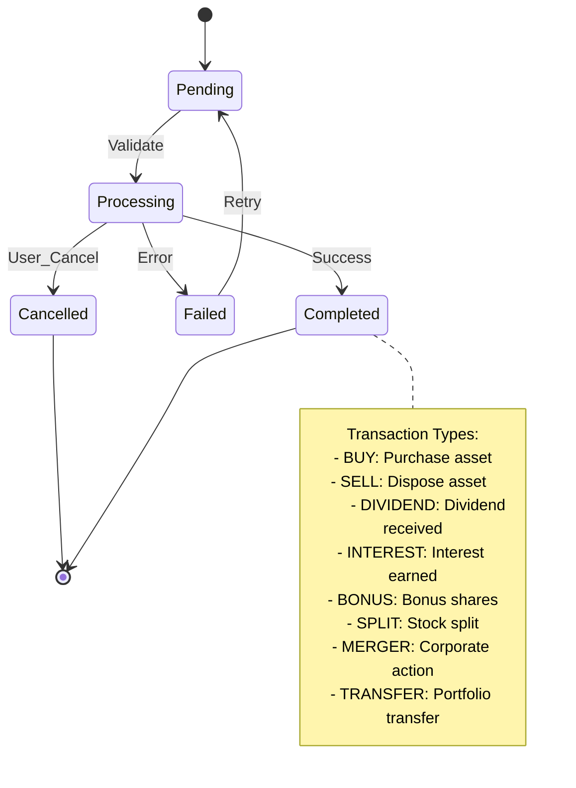
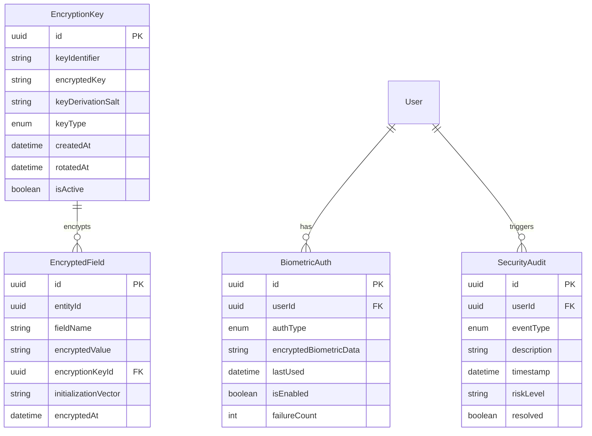
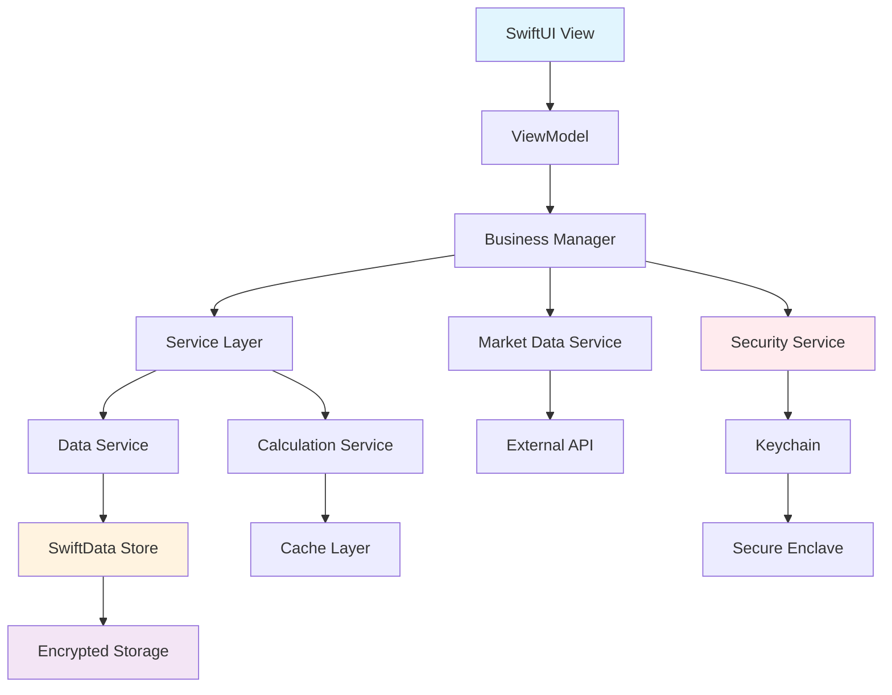
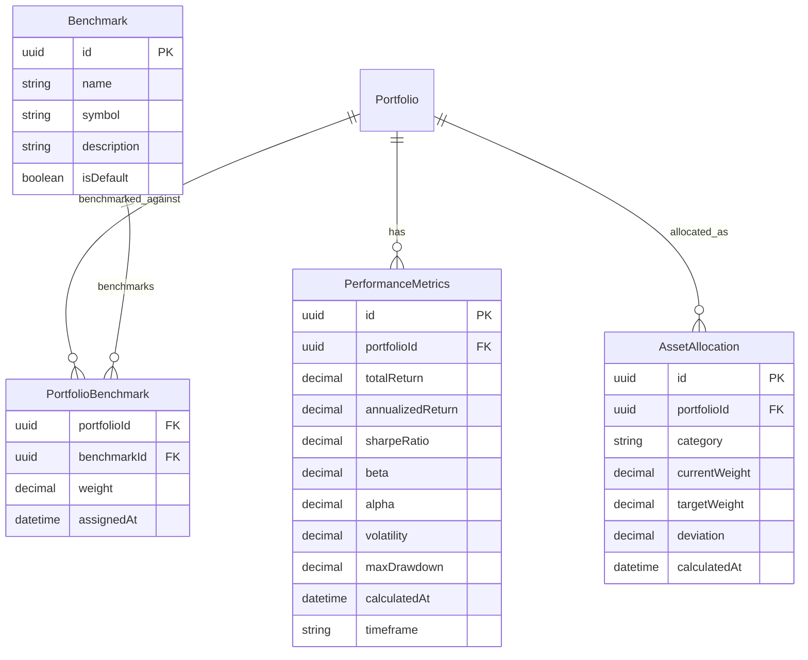
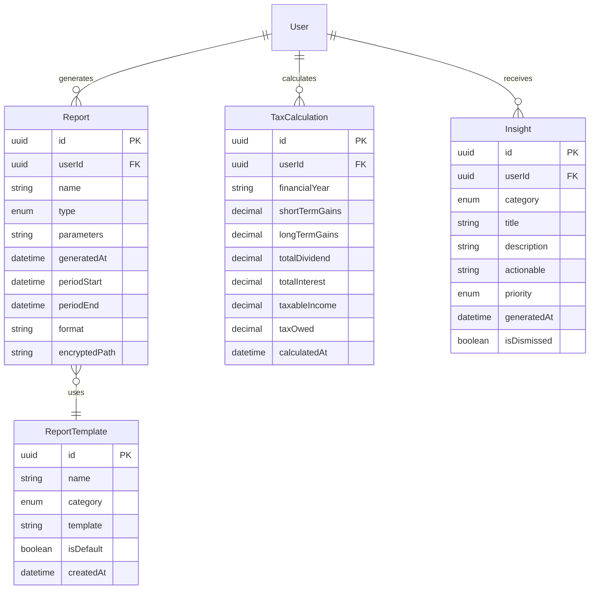
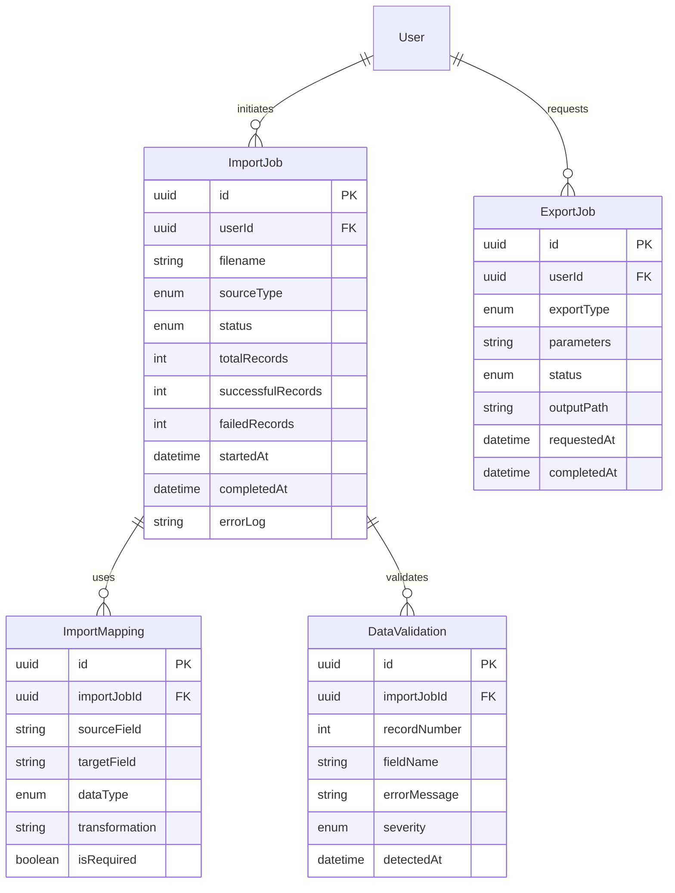
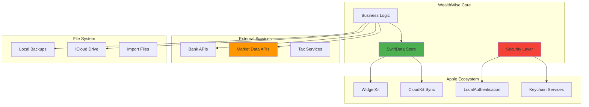

# WealthWise Entity-Relationship Diagrams

## Overview

This document provides comprehensive entity-relationship diagrams for WealthWise, detailing the data models and their relationships. The diagrams reflect the actual implementation in the codebase, including SwiftData @Model entities and Codable structures.

### Documentation Contents
1. **Core Entity Model** - Primary entities with Mermaid ER diagram
2. **Asset Type Hierarchy** - Comprehensive asset classification
3. **Transaction Types & States** - Transaction lifecycle and categories
4. **Security & Encryption Model** - Encryption and key management
5. **Data Flow Architecture** - System data flow patterns
6. **Portfolio Performance** - Performance metrics and calculations
7. **Reporting & Analytics** - Report generation models
8. **Import/Export** - Data import and export structures
9. **System Integration** - External service integration points

### Implementation Status

#### SwiftData @Model Entities (Persistent)
- ✅ **Transaction** - Full implementation with relationships
- ✅ **Goal** - Complete with milestones and contributions
- ⏳ **User** - Planned for authentication system
- ⏳ **Portfolio** - Planned when multi-portfolio support added

#### Codable Structures (Non-Persistent)
- ✅ **CrossBorderAsset** - Comprehensive international asset tracking
- ✅ **PerformanceSnapshot** - Historical performance tracking
- ✅ **ExchangeRate** - Currency conversion rates
- ✅ **TaxResidencyStatus** - Tax jurisdiction tracking
- ✅ **GoalMilestone** - Embedded in Goal entity
- ✅ **TransactionAttachment** - Embedded in Transaction

### Entity Relationship Summary

```
┌────────────────────────────────────────────────────────┐
│              WealthWise Data Model Overview            │
├────────────────────────────────────────────────────────┤
│                                                         │
│  User (Planned)                                        │
│    │                                                    │
│    ├──▶ CrossBorderAsset (Codable)                    │
│    │      └──▶ PerformanceSnapshot[]                   │
│    │      └──▶ IncomePayment[]                         │
│    │      └──▶ TaxResidencyStatus                      │
│    │                                                    │
│    ├──▶ Transaction (@Model)                           │
│    │      ├──▶ TransactionAttachment[]                 │
│    │      └──▶ Goal (@Model)                           │
│    │                                                    │
│    └──▶ Goal (@Model)                                  │
│           ├──▶ GoalMilestone[]                         │
│           ├──▶ GoalContribution[]                      │
│           ├──▶ ProgressSnapshot[]                      │
│           └──▶ Transaction[] (linked)                  │
│                                                         │
│  Relationships:                                        │
│    • User → CrossBorderAsset (1:N)                    │
│    • User → Transaction (1:N)                          │
│    • User → Goal (1:N)                                 │
│    • Transaction ↔ Goal (M:N via linkedGoal)          │
│    • Goal → Transaction (1:N via linkedTransactions)  │
│    • Transaction → Attachments (1:N cascade)          │
│                                                         │
└────────────────────────────────────────────────────────┘
```

## Core Entity Model



## Asset Type Hierarchy

```
Asset Types:
├── Financial Securities
│   ├── Stocks
│   │   ├── Equity Shares
│   │   ├── Preference Shares
│   │   └── ADRs/GDRs
│   ├── Mutual Funds
│   │   ├── Equity Funds
│   │   ├── Debt Funds
│   │   ├── Hybrid Funds
│   │   └── ELSS Funds
│   ├── ETFs
│   │   ├── Index ETFs
│   │   ├── Gold ETFs
│   │   └── International ETFs
│   └── Bonds
│       ├── Government Bonds
│       ├── Corporate Bonds
│       └── Municipal Bonds
├── Bank Products
│   ├── Fixed Deposits
│   ├── Recurring Deposits
│   ├── Savings Accounts
│   └── Current Accounts
├── Alternative Investments
│   ├── Real Estate
│   │   ├── Residential Property
│   │   ├── Commercial Property
│   │   └── REITs
│   ├── Commodities
│   │   ├── Gold (Physical)
│   │   ├── Silver
│   │   └── Other Precious Metals
│   ├── Traditional Investments
│   │   ├── Chit Funds
│   │   ├── Post Office Schemes
│   │   └── Insurance (ULIP/Endowment)
│   └── Cryptocurrency
│       ├── Bitcoin
│       ├── Ethereum
│       └── Other Altcoins
└── Cash & Equivalents
    ├── Cash in Hand
    ├── Bank Balances
    └── Money Market Funds
```

## Transaction Types & States



## Security & Encryption Model



## Data Flow Architecture



## Portfolio Performance Calculations



## Reporting & Analytics Model



## Import/Export Data Model



## System Integration Points



## Notes

### Entity Constraints
1. **User**: Single user per application instance (local-first design)
2. **CrossBorderAsset**: Can be domestic or international, tracks multi-currency assets
3. **Transaction**: SwiftData @Model with comprehensive financial tracking
4. **Goal**: Supports milestone tracking and contribution suggestions
5. **PerformanceSnapshot**: Historical data, maximum 100 snapshots per asset

### Encryption Strategy
- **Field-Level**: Sensitive data encrypted before storage
- **Key Management**: Master key derived from biometric/password
- **Key Rotation**: Periodic rotation with migration support
- **Backup Security**: Separate encryption for export files

### Performance Considerations
- **Indexing**: Primary keys, foreign keys, date fields
- **Caching**: Calculated values cached with invalidation
- **Batch Operations**: Bulk imports/exports optimized
- **Lazy Loading**: Large datasets loaded on demand

### Data Integrity
- **Referential Integrity**: Foreign key constraints
- **Validation Rules**: Data type and range validation  
- **Audit Trail**: All changes logged for compliance
- **Backup Verification**: Checksums for data integrity